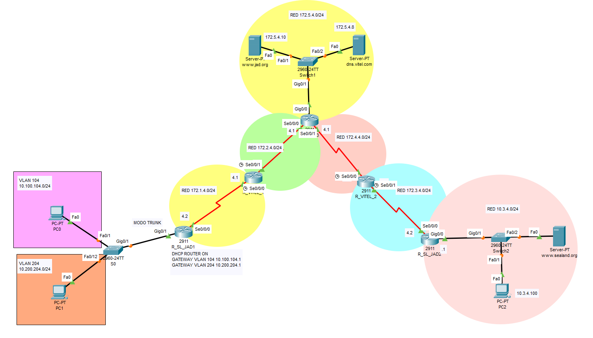

# 🧪 lab Packet Tracer "Sealand"

Simulación de red basada en el país ficticio **Sealand**, desarrollada con **Cisco Packet Tracer**. Este laboratorio pone en práctica conocimientos fundamentales de redes, enrutamiento y servicios básicos, tal como se enseñan en entornos de formación profesional o certificaciones como Cisco CCNA *Creditos a Cisco y a los profesores del instituto Galileo"

## 🗂️ Contenido del proyecto

- Archivo `.pkt` compatible con Cisco Packet Tracer (recomendado: versión 8.x)
- Configuración de dispositivos de red:
  - Routers con interfaces actuando como DTE/DCE
  - Switches con VLANs y PortFast
  - Subinterfaces en routers (Router-on-a-Stick)
  - SSH para acceso remoto seguro
  - Servidores DNS y HTTP
  - PCs y pruebas de conectividad

### Archivos disponibles

- [Topología de red (topologia.png)](./topologia.png)
- [Archivo Packet Tracer (sealand.pkt)](./sealand.pkt)

---

## 🎯 Objetivos del laboratorio

- Diseñar una red organizada basada en un país ficticio (Sealand).
- Crear **VLANs** en los switches.
- Configurar **enlaces troncales entre switch y router** para habilitar el enrutamiento inter-VLAN mediante **subinterfaces (router-on-a-stick)**.
- Establecer **rutas estáticas** entre routers.
- Configurar enlaces seriales con roles **DTE y DCE**.
- Activar **PortFast** en puertos de acceso para acelerar la convergencia de STP.
- Habilitar **SSH** en switches y routers para permitir acceso seguro.
- Simular servicios de red:
  - DNS (resolución de nombres)
  - HTTP (servidor web accesible por IP y FQDN)
- Verificar conectividad con herramientas como `ping`, `tracert` y acceso web.

## 🧰 Tecnologías utilizadas

- **Cisco Packet Tracer** (versión 8.x o superior)
- **Protocolos:** IPv4, IPv6, ICMP, HTTP, DNS, SSH
- **Dispositivos:**
  - Routers Cisco ISR
  - Switches Catalyst 2960
  - PCs y servidores
- **CLI de Cisco IOS**

## 🖥️ Cómo usar

1. Clona o descarga este repositorio.
2. Abre el archivo `.pkt` en Cisco Packet Tracer.
3. Explora la topología y accede a los dispositivos para ver o modificar las configuraciones.
4. Ejecuta pruebas de conectividad y funcionalidad.
5. Usa los comandos incluidos para practicar.

Estare usando este repositorio actualizandolo para implementar todo lo que vaya aprendiendo en el curso que actualmente estoy haciendo de CISCO CCNA 2 - Update 01/07/25
📜 Créditos
Este laboratorio ha sido elaborado como parte de la formación en redes impartida por el:
Instituto Galileo
🧑‍🏫 Pablo Esteban
📧 pablo.profe.tic@gmail.com
